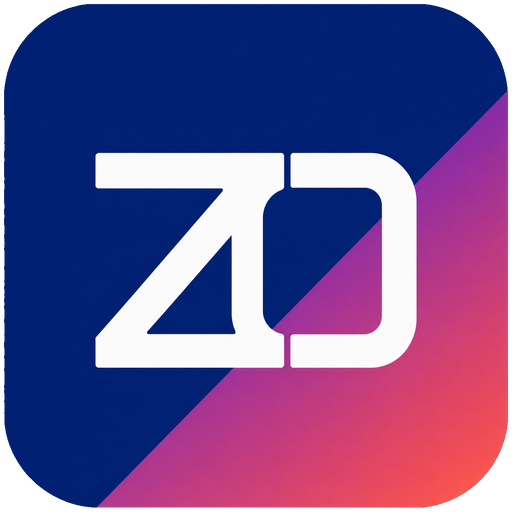
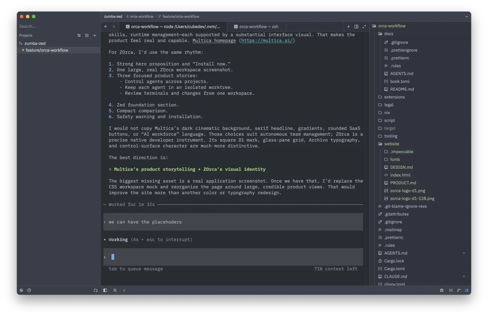
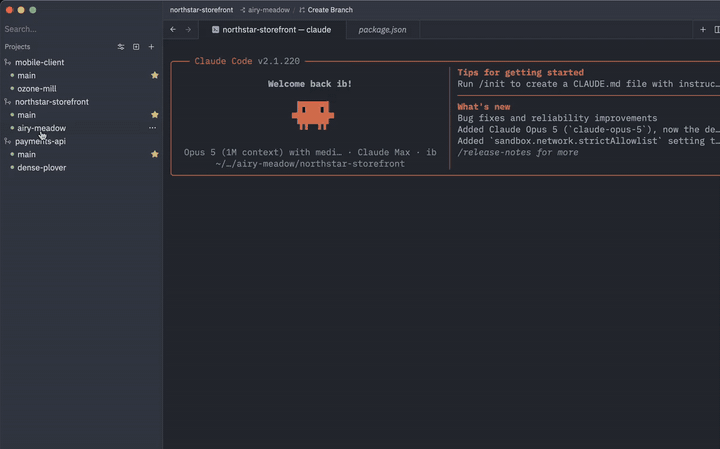
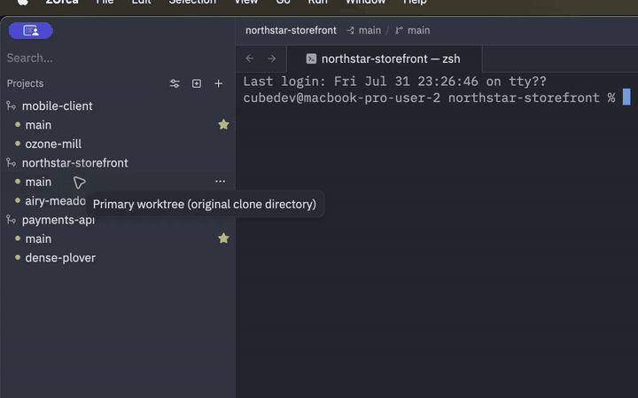
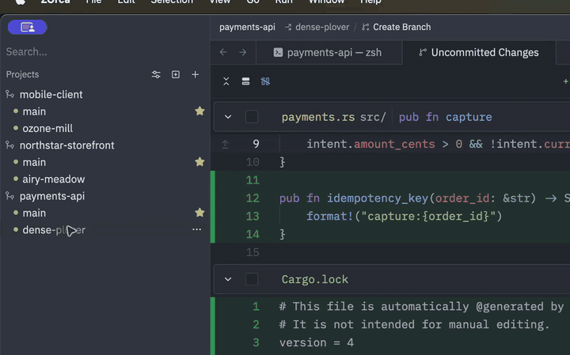

<p align="center">
  
</p>

<h1 align="center">ZOrca</h1>

<p align="center">
  <strong>All your agents. All your projects. One native workspace.</strong>
</p>

<p align="center">
  <a href="https://zorca.net"><strong>Website</strong></a> &middot;
  <a href="#install"><strong>Install</strong></a> &middot;
  <a href="#features"><strong>Features</strong></a> &middot;
  <a href="./CONTRIBUTING.md"><strong>Contributing</strong></a>
</p>

<p align="center">
  <a href="./LICENSE-GPL"></a>
  <a href="#project-status"></a>
  <a href="#install"></a>
  <a href="https://github.com/zed-industries/zed"></a>
</p>

<br />

<p align="center">
  
</p>

ZOrca is a native **Agent Development Environment** that uses
[Zed](https://github.com/zed-industries/zed) as its foundation. Each coding
agent gets a Git worktree, terminal, and diff. ZOrca supports local and
SSH-connected projects. When you return, ZOrca restores the project and session
context.

ZOrca works with the agent CLI that you already use. It keeps agent work
visible. Your existing development workflow remains in place. ZOrca does not
use a terminal wrapper.

<p align="center">
  <strong>Zed + Orca = ZOrca</strong><br />
  <sub>The native editor foundation from Zed with an Orca-inspired, workspace-first approach.</sub>
</p>

## When to use ZOrca

ZOrca is a good fit in these situations:

- You use **Claude Code, Codex, or another terminal agent** across repositories.
- You run several agents at the same time and do not want them to share one checkout.
- You use **local and SSH-connected projects**.
- You want ZOrca to restore projects and agent sessions after an app or connection restart.
- You want the terminal, files, diff, staging area, and history in **one native workspace**.
- You want the full editor from Zed without hosted AI at the center of the product.

## How it works

Use this workflow:

1. Open a project. ZOrca keeps the repository, local or remote connection, and worktrees together.
2. Start an agent. ZOrca gives the agent one worktree and as many terminal tabs as you need.
3. Review the result. The terminal stays visible while you inspect files and diffs, stage changes, commit, and browse history.
4. Return later. ZOrca restores the project tree, active workspace, and persistent terminal sessions.

## Features

### Project and session restoration

ZOrca keeps local and SSH-connected repositories in one sidebar. It saves the
project tree, active workspace, and agent terminal sessions. When the app or
connection returns, ZOrca restores that context. Persistent sessions reconnect
after they become available. You can also recreate them in place.

<p align="center">
  <a href="website/zorca-projects.mp4"></a>
</p>

### Separate worktree for each agent

ZOrca gives each agent a separate Git worktree. Thus, agents do not change the
same checkout. Each workspace keeps the terminal context and working files of
its agent.

<p align="center">
  <a href="website/zorca-worktree.mp4"></a>
</p>

### Terminal and change review

The Git cockpit follows the active workspace. You can inspect diffs, stage
changes, commit, and browse history. The agent terminal stays visible during
the review.

<p align="center">
  <a href="website/zorca-git-review.mp4"></a>
</p>

## Editor features from Zed

ZOrca reorganizes Zed for agent workspaces. It does not rebuild the editor.

| Editing | Navigation and tooling |
| --- | --- |
| LSP and tree-sitter | Debugger and multibuffers |
| Native Vim keybindings | Themes |
| Zed Extensions | `zed://` URLs |

ZOrca also includes these features:

- The sidebar supports multiple repositories and worktrees.
- ZOrca supports local workspaces and SSH-connected remote workspaces.
- ZOrca stores projects, workspace state, and agent terminal sessions.
- Each project worktree supports as many agent terminal tabs as you need.
- The Git tools support diffs, staging, commits, and history.
- ZOrca does not provide hosted AI and does not require a ZOrca account. GitHub Copilot remains optional.

## Install

> [!NOTE]
> ZOrca is pre-alpha. Nightly builds can change without notice. Automatic
> updates are not available.

### Nightly builds

[GitHub Releases](https://github.com/zorca-org/zorca/releases) provides nightly
builds for Windows and Linux. A macOS nightly build is not available yet.

On Windows, download `ZOrca-Nightly-x86_64.exe`. Then run the installer.

On Linux, download `zorca-linux-x86_64.tar.gz`. Then install it with the
repository installer:

```sh
git clone https://github.com/zorca-org/zorca.git
cd zorca
ZORCA_CHANNEL=nightly \
ZORCA_BUNDLE_PATH="$HOME/Downloads/zorca-linux-x86_64.tar.gz" \
./script/install.sh
```

If the archive is in a different directory, change `ZORCA_BUNDLE_PATH`.

### Build from source

Clone the repository before you run the platform commands:

```sh
git clone https://github.com/zorca-org/zorca.git
cd zorca
```

### macOS

Install the prerequisites from the [macOS development guide from Zed](https://zed.dev/docs/development/macos).

Build and install ZOrca in `/Applications`:

```sh
./script/bundle-mac -i
```

For development, build and run ZOrca with Cargo:

```sh
cargo zorca
```

### Linux

Install the prerequisites from the [Linux development guide from Zed](https://zed.dev/docs/development/linux).

Install the build dependencies. Then build and install ZOrca in `~/.local`:

```sh
./script/linux
./script/download-wasi-sdk
./script/install-linux
```

For development, build and run ZOrca with Cargo:

```sh
cargo zorca
```

## Where ZOrca fits

ZOrca combines the Zed editor with agent workspaces. Zed is the upstream editor.
[Orca](https://github.com/stablyai/orca) provides the broader ADE today.

| Capability | ZOrca | Zed | Orca |
| --- | --- | --- | --- |
| **Workspace model** | Agent workspaces with Git worktrees | Project folders | Agent workspaces |
| **Remote projects** | SSH workspaces | SSH projects | Remote workspaces |
| **Agent terminals** | Multiple tabs per project worktree | Terminal dock | First-class |
| **Automation and orchestration** | No. Hands-on control only. | No | Yes |
| **Built-in AI** | No hosted AI. Copilot is optional. | Hosted Zed AI | Bring your own |
| **Availability** | Desktop source builds. Mobile is on the roadmap. | Desktop app | Desktop and mobile apps |

Choose **Zed** for the upstream editor and hosted AI from Zed.

Choose **Orca** for fleet orchestration, automation, and mobile control.

Choose **ZOrca** for the Zed editor, a worktree-first layout, and direct control
of agents across projects.

## Planned directions

These roadmap items are planned directions. They are not current capabilities.
The project does not promise dates for them.

The roadmap includes these directions:

- **REST API and CLI.** ZOrca will support external control and integrations.
- **Mobile app.** Users will manage workspaces and agent sessions away from the desktop.

## Relationship to Zed

ZOrca is an independent hard fork of Zed. It uses the Rust and GPUI foundation
from Zed. It also uses the editing engine, terminal renderer, Git tools,
extensions, accessibility features, persistence, and platform support from Zed.
ZOrca follows a separate product direction and release lifecycle.

The fork organizes the workspace around projects, worktrees, and agent
terminals in the center pane. ZOrca removes hosted AI from Zed. GitHub Copilot,
the extension API, and `zed://` URLs remain available.

ZOrca does not promise compatibility with Zed or routine synchronization with
upstream changes. The project can port upstream fixes and improvements that fit
the ZOrca direction.

This repository accepts ZOrca-specific issues and contributions. The
[Zed repository](https://github.com/zed-industries/zed) separately accepts
changes that also apply to Zed.

## Project status

ZOrca is pre-alpha. Nightly packages are available for Windows and Linux.
macOS supports source builds. Breaking changes can occur.

The current release has these limits:

- ZOrca does not provide automatic updates.
- ZOrca does not provide a macOS package yet.
- ZOrca does not provide fleet orchestration or scheduled automation.

ZOrca is an independent hard fork. Zed Industries and Stably AI do not endorse
ZOrca. ZOrca has no affiliation with either company.

## Contributing

Read [CONTRIBUTING.md](./CONTRIBUTING.md) for instructions to build, test, and
contribute.

## License

ZOrca uses GPL-3.0-or-later. The repository preserves upstream copyright and
license notices. Read [LICENSE-GPL](./LICENSE-GPL) and
[LICENSE-APACHE](./LICENSE-APACHE) for details.
